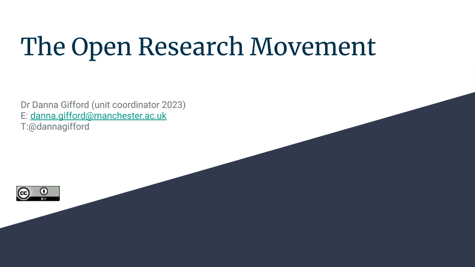
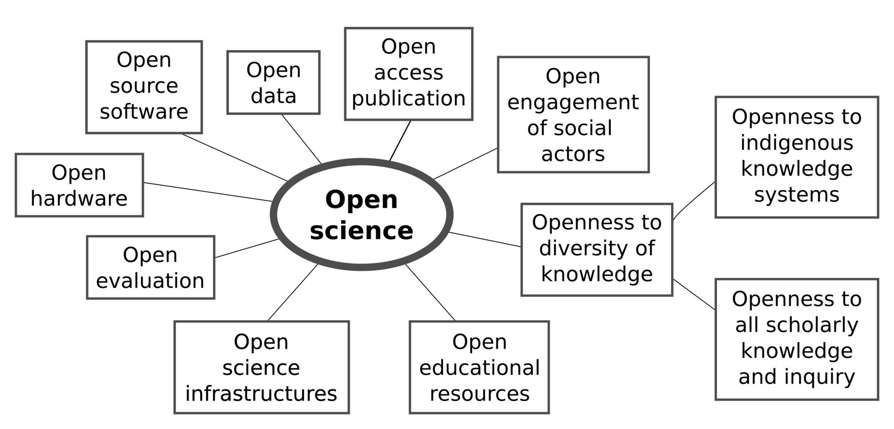
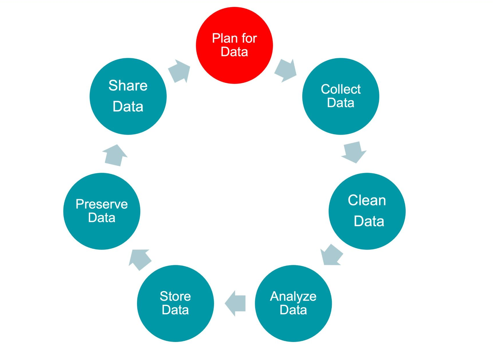

# Introduction

Up until now, we've discussed reproducible data science from a theoretical point of view, while also discussing some of the tools you can use to achieve these aims. This workshop will discuss the Open Research Movment more broadly, and organisations involved in its promotion. We will also have a look at some resources provided by The University of Manchester to assist researchers (such as yourselves!) in achieving open and reproducible research.

## Slides
[{width="75%"}](../slides/The_Open_Research_Movement.odp)

The Open Research Movement is a global initiative that seeks to revolutionize the way research is conducted, shared, and accessed. It is driven by a set of core principles that emphasize openness, transparency, and collaboration throughout the research process. In this workshop, we will delve into the key aspects and benefits of the Open Research movement.

Listen to Andrew Stewart (Institutional Lead for Open and Reproducible Research at The University of Manchester) speak about the benefits and challenges of conducting open research:
<iframe width="560" height="315" src="https://www.youtube.com/embed/wyS7tJPDcq0?si=u6LMTvBHFu_M7-pC" title="YouTube video player" frameborder="0" allow="accelerometer; autoplay; clipboard-write; encrypted-media; gyroscope; picture-in-picture; web-share" allowfullscreen></iframe>

# Key Principles of Open Research

## Open Access

Open Access is a cornerstone of the Open Research movement. It advocates for the unrestricted availability of research publications, data, and findings to the public. Researchers and institutions are encouraged to make their work freely accessible, either through open-access journals, preprint servers, or institutional repositories. Open Access promotes the democratization of knowledge by removing financial barriers to access, enabling anyone with an internet connection to benefit from research findings.

Organizations like the [Open Access Scholarly Publishers Association (OASPA)](https://oaspa.org/) and [Directory of Open Access Journals (DOAJ)](https://doaj.org/) are at the forefront of advocating for and ensuring the quality and integrity of open-access journals. They work diligently to establish best practices and standards in open-access publishing. Additionally, institutions and funders play a significant role in advancing open access. Bodies such as the [Open Research Funders Group (ORFG)](https://www.orfg.org/) and [Plan S](https://www.coalition-s.org/) are driving initiatives to make research outputs openly accessible, thereby democratizing knowledge and fostering innovation.  

Watch this animated video narrated by [Nick Shockey](https://sparcopen.org/people/nick-shockey) (Director of Programs & Engagement for [SPARC](https://sparcopen.org)) and [Jonathan Eisen](https://en.wikipedia.org/wiki/Jonathan_Eisen) (Advisory Board Member for open access journal [PLOS Biology](https://journals.plos.org/plosbiology)), animations by [Jorge Cham](https://jorgecham.com/) ([PhD Comics](https://phdcomics.com/)). 
<iframe width="560" height="315" src="https://www.youtube.com/embed/L5rVH1KGBCY?si=nztcmRGApVMzUwap" title="YouTube video player" frameborder="0" allow="accelerometer; autoplay; clipboard-write; encrypted-media; gyroscope; picture-in-picture; web-share" allowfullscreen></iframe>

## Open Data

Open Data is the practice of openly sharing research data, allowing others in the scientific community and beyond to access, scrutinize, and build upon it. Researchers are encouraged to provide well-documented datasets alongside their publications. This openness not only enhances the reproducibility of research but also fosters innovation, as diverse perspectives can be applied to existing datasets to answer new questions or explore new hypotheses.

Addressing a significant challenge in data-intensive science involves aiding both humans and machines in discovering, accessing, integrating, and analyzing scientific data along with their associated algorithms and workflows to facilitate knowledge discovery. In 2016, the [FAIR Guiding Principles](https://www.go-fair.org/fair-principles/) for scientific data management and stewarship were established. FAIR stands for Findability, Accessibility, Interoperability, and Reuse of digital assets.

Several platforms serve as excellent places for sharing open data, with [Figshare](https://figshare.com/) being a prominent example. Figshare provides researchers with a user-friendly, web-based repository where they can effortlessly upload, manage, and share their datasets. Its versatility extends beyond data storage, as it accommodates a wide range of research outputs, including figures, code, presentations, and more. Researchers benefit from Figshare's commitment to open access, as it facilitates the seamless dissemination of data to the global scientific community. Moreover, Figshare offers tools for data citation, ensuring proper attribution and recognition for data creators. Beyond Figshare, other notable platforms like [Zenodo](https://zenodo.org/), [Dataverse](https://dataverse.org/), and [Dryad](https://datadryad.org/) also contribute significantly to the open data landscape, collectively fostering a culture of data sharing and accessibility that accelerates scientific discovery and innovation.

In genomics research, sharing data is pivotal, and two prominent databases, [NCBI](https://www.ncbi.nlm.nih.gov/) and [ENA](https://www.ebi.ac.uk/ena), facilitate this practice. NCBI's GenBank and ENA store diverse genomic data, fostering global collaboration and data transparency. Researchers worldwide access, analyze, and contribute to these databases, advancing scientific understanding of genetics. Sharing data played a critical role during the COVID-19 crisis, enabling rapid global collaboration among scientists, researchers, and healthcare professionals to better understand the virus, track its spread, and develop effective interventions and vaccines.  

Read [Intelligent open science: viral genomic data sharing during the COVID-19 pandemic](intelligent-open-science.pdf), a case study commissioned by the GOV.UK, to learn more.

## Open Collaboration

Open Collaboration is a fundamental tenet of the Open Research movement. It encourages researchers to collaborate across disciplines, institutions, and geographical boundaries. By breaking down silos and fostering interdisciplinary teamwork, Open Collaboration can lead to more comprehensive and innovative research outcomes. Initiatives such as open-source software development and collaborative research platforms play a crucial role in facilitating these collaborations.

Initiatives such as and [Collaborative Open Innovation Network (CoINs)](https://en.wikipedia.org/wiki/Collaborative_innovation_network) are dedicated to promoting Open Collaboration. These organizations provide platforms, resources, and networks that facilitate knowledge sharing and collaborative efforts, bridging gaps in research and accelerating progress in diverse fields. Read the following article to learn more:  

Levine, Sheen S. and Michael J. Prietula. (2013) [Open Collaboration for Innovation: Principles and Performance](https://pubsonline.informs.org/doi/10.1287/orsc.2013.0872) Organization Science.

Made by [RobbieIanMorrison](https://commons.wikimedia.org/wiki/User:RobbieIanMorrison) and used under [CC-BY 4.0](https://creativecommons.org/licenses/by/4.0)

# Advantages of Open Research

## Reproducibility

One of the central advantages of Open Research is reproducibility. By making research methods, data, and code openly available, researchers can ensure that their work is transparent and accessible. This transparency allows other researchers to validate and reproduce findings, enhancing the credibility and reliability of scientific research. Reproducibility is essential for building a solid foundation of knowledge upon which future research can be built.

## Innovation

Innovation thrives in the open research environment. Openly accessible data, findings, and collaborative opportunities enable researchers to leverage existing work to drive new discoveries and advancements. The ability to build upon the work of others accelerates the pace of innovation and can lead to breakthroughs in various fields, from medicine to technology.

## Accessibility

Open Research promotes accessibility by making research outputs available to a broader audience, including individuals outside the academic community. This accessibility has the potential to bridge the gap between academic research and practical applications in the real world. Policymakers, educators, and the general public can benefit from access to research findings, leading to evidence-based decision-making and societal progress.

# Challenges and Future Directions

While the Open Research movement has made significant progress, it faces several challenges on its path to widespread adoption. These challenges include securing sustainable funding for open-access publishing, addressing data privacy concerns, and fostering cultural shifts within academia that prioritize openness and collaboration.

However, the future of Open Research looks promising. More funding agencies, institutions, and individual researchers are embracing its principles. Initiatives to develop open research infrastructure and support open science practices are gaining momentum, indicating a positive trajectory for the movement.

# How to conduct open & reproducible science?

## Before starting a project

### Preregistration
Preregistration is a crucial and practical aspect of conducting open science. It involves specifying a research plan in advance and submitting it to a registry like the Open Science Framework (OSF). This practice offers several significant advantages:

1. **Distinguishing Between Exploratory and Confirmatory Phases**: Preregistration helps researchers clearly separate their work into hypothesis-generating (exploratory) and hypothesis-testing (confirmatory) phases. In the hypothesis-generating phase, researchers explore data, generate ideas, and formulate hypotheses. The confirmatory phase involves testing these hypotheses using predetermined methods. By distinguishing these phases, researchers reduce the likelihood of "p-hacking" and data-driven hypothesis generation, which can lead to false-positive results.

2. **Enhancing Research Quality and Transparency**: Preregistration promotes research quality and transparency. When researchers outline their study design, hypotheses, data collection methods, and analysis plans in advance, it minimizes the potential for bias and selective reporting. This transparency allows other researchers to understand the study's scope and methods, facilitating the critical evaluation of the research.

3. **Facilitating Clear Reporting**: Preregistration aids in the clear and comprehensive reporting of research findings. When a study's design and analysis plan are pre-registered, it becomes easier for authors to report their methods and results accurately. This benefits readers, reviewers, and journal editors by ensuring that the research process is documented thoroughly and consistently.

4. **Supporting Reproducibility and Replication**: Preregistration contributes to the overall goal of open science by making research more reproducible and replicable. Others who wish to replicate or build upon the research can use the preregistered plan as a blueprint for their own work. This ensures that the study can be tested independently, thereby increasing confidence in the validity of the findings.

5. **Encouraging Collaboration and Innovation**: Sharing research plans through preregistration can foster collaboration and innovation within the scientific community. When researchers are transparent about their intentions, it becomes easier for other scholars to identify areas of shared interest, potentially leading to collaborative projects and the development of new research questions.

6. **Guarding Against HARKing (Hypothesizing After the Results are Known)**: Preregistration helps prevent the unethical practice of HARKing, where researchers formulate hypotheses based on observed results rather than a priori. This minimizes the risk of cherry-picking data or selectively reporting findings, which can distort the scientific record.

### Having a data management plan
A Data Management Plan (DMP) is a vital component of open science that organizes data handling processes, defines the types and storage of data, ensures data security and integrity, facilitates data sharing and future research access, and is often required by most funding bodies. Here's a breakdown of the key advantages of having a DMP:

1. **Organizes Data Handling Processes**: A DMP provides a structured approach to handling research data. It outlines the workflow for data collection, storage, analysis, and archiving. This organization ensures that data is managed efficiently throughout the research project.

2. **Defines Types and Storage of Data**: A well-crafted DMP specifies the types of data generated during the research and their appropriate storage methods. This clarity prevents data loss, data mismanagement, and helps researchers select suitable storage solutions.

3. **Ensures Data Security and Integrity**: Security and data integrity are paramount in open science. A DMP includes measures for data security, such as access control, encryption, and backup protocols, ensuring that research data is protected from loss, theft, or corruption.

4. **Facilitates Data Sharing and Future Research Access**: Open science encourages data sharing. A DMP outlines the steps for sharing data with the research community. By adhering to these plans, researchers make their data accessible for future research, promoting transparency and collaboration.

5. **Required by Most Funding Bodies**: Many funding bodies and research institutions mandate the submission of a DMP as part of the research proposal. Complying with this requirement is essential for securing research funding, making the DMP a practical necessity.

## During the Project
### Documenting Analysis and Data Collection

Documenting the process of analysis and data collection is a fundamental aspect of open science. It is crucial because it ensures data integrity, minimizes reliance on fallible human memory, and facilitates transparent communication of findings. Here's a breakdown of the key benefits of thorough documentation:

1. **Do Not Rely on (Fallible) Human Memory**: Human memory is prone to errors and omissions. Relying on memory to accurately recall details of experiments and results can compromise the integrity of research. Documentation helps researchers avoid memory-related inaccuracies and ensures that every aspect of the research process is recorded.

2. **Keeping a Good Lab Book Ensures Data Integrity**: A well-maintained lab notebook is a cornerstone of open science. It serves as a primary record of all activities related to data collection and analysis. By consistently documenting details, researchers safeguard the integrity of their data, making it easier to track changes and trace back to the original observations.

3. **Record Details Such as Dates and Names**: Detailed documentation should include information such as dates, names of individuals from whom materials were received, and precise descriptions of experimental approaches and calculations. This level of detail is essential for research reproducibility, as it enables other researchers to understand and replicate the procedures accurately.

4. **Ensure Accurate Capture of Protocol Information**: Documenting analysis and data collection protocols is essential for the precise replication of experiments. Without clear documentation, it becomes challenging for others to understand the methodology used and verify the research results. Accurate capture of protocol information is a key aspect of open science's commitment to transparency.

5. **Documenting Facilitates Communication of Findings**: Comprehensive documentation is a valuable asset when it comes time to communicate research findings. Researchers can draw upon their records to write up detailed and transparent research papers or reports. This makes it easier to share knowledge with the scientific community, increasing the overall transparency and reproducibility of research.

Consider the use of Electronic Laboratory Notebooks (ELNs) for capturing methods, data and associated metadata in one place.

### Using Open Source Software

The use of open source software for analysis is a fundamental practice in open science, offering numerous advantages, including transparency, accessibility, and adaptability. Here's a closer look at these benefits:

1. **Transparent and Accessible Code**: Open source software comes with openly available source code, making it easier for others to verify and replicate research results. Transparency is a core principle of open science, and open source software aligns perfectly with this principle. Researchers can scrutinize the code to ensure that data analysis is conducted accurately, promoting trust in the research process.

2. **Usually Free to Use**: Open source software is typically free to use, which promotes inclusivity within the scientific community. By eliminating cost barriers, it ensures that tools are accessible to all researchers, regardless of their financial resources. This inclusivity fosters a more equitable and diverse research environment.

3. **Customization and Adaptability**: Open source software can be modified and customized to suit specific research needs. Researchers are not bound by the limitations of proprietary software and can tailor the software to their unique requirements. This adaptability leads to a more flexible and dynamic scientific environment, where tools can evolve alongside research objectives.

## After the project
### Using Data Repositories
Data repositories play a pivotal role in supporting open science by centralizing data storage and sharing, catering to specific data requirements, and moving away from traditional data handling practices. Here's a closer examination of these advantages:

1. **Centralizing Data Storage and Sharing**: Data repositories serve as centralized platforms for storing and sharing research data. These repositories, such as Figshare, Dryad, and Zenodo, facilitate the open sharing of data, enabling researchers to make their datasets easily accessible to the scientific community. This centralized approach promotes transparency, reproducibility, and collaboration.

2. **Field-Specific or Data Type-Specific Repositories**: Data repositories are often tailored to specific data requirements. For instance, the National Center for Biotechnology Information (NCBI) and the European Nucleotide Archive (ENA) are repositories specializing in biological data. These field-specific or data type-specific repositories provide specialized infrastructure for data storage, ensuring that data is managed and presented in a manner that aligns with the unique needs of each scientific domain.

3. **Moving Away from 'Available on Request' Statements**: Traditionally, researchers have used 'available on request' statements in papers or have included data as supplementary materials, which may not be indefinitely maintained by journals. This practice can hinder data accessibility and long-term preservation. Data repositories offer an alternative solution by providing a stable and reliable platform for data storage, ensuring that datasets are accessible and maintained beyond the publication of a research paper.

### Using software repositories
Using software repositories is an essential practice in open science, especially when research generates software. These repositories provide centralized storage and sharing for research code, which promotes transparency and collaboration. Let's explore the advantages of this approach:

1. **Storage for Research Software**: If your research generates software, it's crucial to store it in a software repository. This repository acts as a dedicated platform for preserving, sharing, and collaborating on the code. Examples of such repositories include GitHub and SourceForge.

2. **Centralized Storage and Sharing**: Software repositories offer centralized storage for research code, making it accessible to the broader scientific community. Researchers can upload their code, documentation, and related materials, facilitating transparency and collaboration. Collaborators, reviewers, and other researchers can easily access and contribute to the codebase.

3. **Improved Research Reproducibility and Version Control**: Using software repositories improves research reproducibility. Version control systems, such as Git, enable researchers to track changes, manage different versions of the code, and document any alterations. This ensures that the history of code development is well-documented and can be referenced for research validation.

4. **Searching of Code Databases**: Software repositories often have robust search features that allow researchers to discover code related to their specific field or research interests. These search capabilities can help researchers find relevant code, saving time and promoting knowledge exchange.

5. **Centralized Bug Reporting**: Software repositories provide mechanisms for bug tracking and issue reporting. Researchers and users can report issues, suggest improvements, and collaborate on resolving problems. This centralized bug reporting system streamlines the code development process and ensures that issues are addressed promptly.

6. **Encourages Open Sharing and Research Advancement**: Software repositories encourage open sharing of code and knowledge exchange. By making research code accessible to others, researchers foster an environment of openness, collaboration, and research advancement. Others can build upon existing work, accelerating scientific progress.

### Preprints and open access publishing

Publishing preprints and open access papers is a cornerstone of open science, providing several advantages that promote collaboration, early feedback, and broad knowledge dissemination within the scientific community. Here are the key points:

1. **Preprints Provide Swift Sharing of Research Findings**: Preprints are preliminary versions of research papers that allow researchers to share their findings swiftly, often before peer review. This rapid dissemination of research results accelerates the exchange of knowledge, facilitating the sharing of novel discoveries with the scientific community.

2. **Open Access Ensures Free and Unrestricted Access**: Open access publishing makes research papers freely and openly accessible to all, removing financial barriers. Researchers, students, and the public can access and benefit from research without any restrictions or costs. This openness enhances the impact and reach of research.

3. **Gold Open Access**: Gold open access publishing makes research papers immediately and freely available to the public upon publication. However, it typically involves publication charges (often covered by the author or their institution). Gold open access ensures immediate global accessibility to research findings.

4. **Green Open Access**: Green open access involves making the "author accepted manuscript" available in a repository or through the publisher after an embargo period. While it may involve some restrictions initially, it ultimately allows research to become freely accessible. This approach provides a compromise between openness and publisher policies.

5. **Promotes Collaboration and Early Feedback**: Both preprints and open access papers promote collaboration by providing a platform for researchers to share their work openly. This early sharing encourages discussions, feedback, and the potential for collaboration even before formal peer review. It can lead to improvements in research and the generation of new ideas.

6. **Broad Knowledge Dissemination**: Open science, through preprints and open access papers, ensures that research findings reach a wide and diverse audience. This broad dissemination of knowledge is crucial for the advancement of science, as it allows researchers from various backgrounds to access and build upon existing work.

### Open licencing and content reuse

In open science, the use of open licensing is a powerful way to enable the reuse and adaptation of materials. When considering where to publish your work, it's essential to choose journals that support these licensing options. Here are key points to consider:

1. **Creative Commons Licensing**: Creative Commons (CC) licenses are widely used in open science to specify the terms under which content can be reused. Two common CC licenses are:

   - **CC BY 4.0 (Attribution)**: This license allows others to reuse your work, provided they give proper attribution, similar to citing your work in a research paper. It promotes open sharing and recognition of the original author's contributions.

   - **CC0 ("No Rights Reserved" or Public Domain Dedication)**: CC0 essentially places your work in the public domain, where there are no copyright restrictions. This allows maximum freedom for others to reuse, adapt, and build upon your work without any legal barriers.

2. **Allows Work to Be Adapted and Reused**: Creative Commons licensing, especially CC BY 4.0 and CC0, empowers researchers and creators by allowing their work to be adapted, reused, and built upon. This encourages collaboration, accelerates scientific progress, and increases the availability of valuable research materials.

3. **Journals Supporting CC BY 4.0**: Some journals are committed to open access and provide the option of publishing under a CC BY 4.0 license. Notable examples include:

   - **PLOS Biology**
   - **eLife**
   - **PeerJ**
   - **BMC Biology**
   - **Scientific Reports**
   - **Nature Communications** (and other open access titles published by Nature Publishing Group)

These journals offer researchers the opportunity to publish their work with a CC BY 4.0 license, which encourages reuse, adaptation, and broad dissemination of their findings.

# Open Research at The University of Manchester

The University of Manchester is an active participant in the Open Research Movement, demonstrating a strong commitment to openness, transparency, and collaboration in research practices. The University has embraced Open Access publishing, making a significant portion of its research output freely available to the public, thereby increasing the accessibility of knowledge. Moreover, it actively encourages researchers to share their datasets openly, promoting the principles of Open Data. The University also fosters interdisciplinary collaborations and provides support for researchers to engage in open science initiatives, thus contributing to the ethos of Open Collaboration. By championing these principles and actively participating in the Open Research Movement, the University is not only advancing the credibility and reproducibility of research but also fostering a culture of innovation and knowledge sharing within its academic community and beyond.

Listen to Professor Collette Fagan speak about The University of Manchester's committment to Open Research and read about the University's [Position Statement on Open Research](https://www.openresearch.manchester.ac.uk/about-us/position-statement/). You can also explore [Support offered by the University](https://www.openresearch.manchester.ac.uk/support/) for conducting Open Research:  
<iframe width="560" height="315" src="https://www.youtube.com/embed/aWOb9KHaQv0?si=mmur-LDtIXQUQxmJ" title="YouTube video player" frameborder="0" allow="accelerometer; autoplay; clipboard-write; encrypted-media; gyroscope; picture-in-picture; web-share" allowfullscreen></iframe>

## The Office for Open Research
Led by the Library, the [Office for Open Research](https://www.openresearch.manchester.ac.uk/) supports the University's aims to create a more open and responsible research environment. It represents one of the most substantial investments in the future of publishing, data, and open knowledge ever made by a UK university. The establishment of the Open Research Service Partnership is part of a coordinated effort to respond to the Open Research agenda, further bolstering the support available to researchers and expediting the adoption of Open Research practices. The creation of this office establishes a central hub for Open Research initiatives at The University of Manchester, positioning the institution at the forefront of this global movement. Fostering open dialogue with the research community is a priority, allowing for the clear delineation of Open Research goals and the accommodation of the diverse needs of various research communities.

Watch this video to learn more about the initiatives undertaken by the University:  
<iframe width="560" height="315" src="https://www.youtube.com/embed/78nbIrgS2LY?si=9t2wUHMFMyPbaHCr" title="YouTube video player" frameborder="0" allow="accelerometer; autoplay; clipboard-write; encrypted-media; gyroscope; picture-in-picture; web-share" allowfullscreen></iframe>

# Tools provided to support Open Research

## Managing research data

Listen to Dr Patrick Manu speak about the process of open research and open research practices
<iframe width="560" height="315" src="https://www.youtube.com/embed/3gRfY8J6bOI?si=M1v0GpbNHkBMgyjQ" title="YouTube video player" frameborder="0" allow="accelerometer; autoplay; clipboard-write; encrypted-media; gyroscope; picture-in-picture; web-share" allowfullscreen></iframe>

In line with the open research movement, it is increasingly common for [funding agencies](https://www.library.manchester.ac.uk/services/research/research-data-management/policies/funders/) to mandate the creation of data management plans (DMPs) as part of grant applications. The University of Manchester's [Research Data Management (RDM) Policy](https://www.library.manchester.ac.uk/services/research/research-data-management/policies/) extends this requirement to all research projects, whether they receive funding or not. These DMPs are essential for projects, which are time-limited efforts aimed at addressing specific research questions. In cases of collaborative projects where the university is not the lead institution, a DMP is necessary to address data management for Manchester-based data. Researchers are encouraged to consult the Policies page to ensure compliance with their funder's data requirements. It's worth noting that terminology related to DMPs can vary among funders, with terms like Data Management and Sharing Plan or Outputs Management Plan also in use. Additionally, it's crucial to follow specific protocols, such as the Standard Operating Procedure for recording and storing audio, video, and images of research participants.

The University of Manchester offers this version of [DMPonline](https://dmponline.manchester.ac.uk/) to assist in writing data management plans. It provides access to valuable guidance, advice, and template responses.

Listen to Lorraine Beard speak the Open Research Service Partnership and maintaining responsible metrics for research
<iframe width="560" height="315" src="https://www.youtube.com/embed/8nMqRaM4M2A?si=g6Cxgee12hY4tgZt" title="YouTube video player" frameborder="0" allow="accelerometer; autoplay; clipboard-write; encrypted-media; gyroscope; picture-in-picture; web-share" allowfullscreen></iframe>

## Your challenge

Your challenge is to think about how you would incorporate the principles of the Open Research Movement in your own research. For those of you registered for The University of Manchester's MSci research project, this will help you prepare for writing your research proposal. Do you have clear hypotheses to test from the outset? How will you manage your data to make sure it is kept accurate and safe during your project? How will you make your data accessible when your project is finished? What journals in your research area support the Open Research Movement (e.g. through publishing open access and/or requiring data to be made available)?

